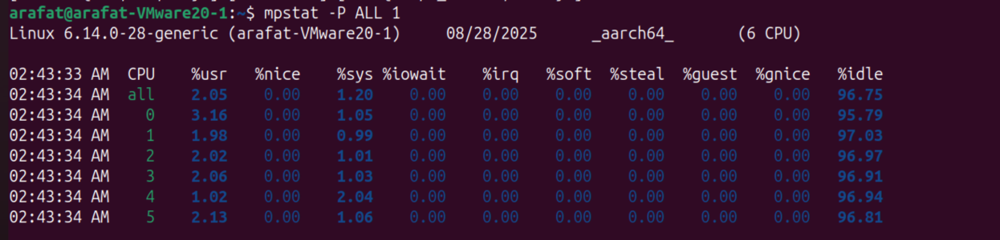
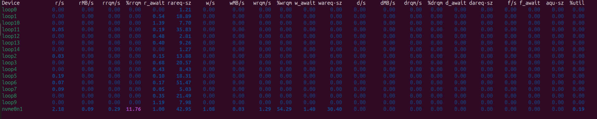

# The Baic Observability for first 60 seconds

Whenever we need to execute an investigation, we first run these. These are an overview to the whole system. From the very first 60 seconds, we need to have a general understanding of whats wrong (or even if anything wrong), and then deep dive to related section (Network stack, device stack, kernel...)


## uptime

input

```bash
uptime
```


```bash
 ---------- load average: {1 minute}, {5 minute}, {15 minute}
 ```

CPU initial check, are we bottlenecking CPU recently


## top (avoid htop)

Real time Process view with CPU global view, MEM global view, and per process stats

Press "H" so switch to thread views


First Line: From uptime
Second: Running and sleep monitor. "H" to switch to threads.

```bash
top -c -d #interactive mode, more fun, d -> refresh time, can be 1,2,3 or even 0.1

# 1 -> individual cpu display toggle(mpstat)
# t -> cycle cpu display modes
# m -> cycle memory display modes
# H (CAPS lock and h) -> thread view toggle
# V -> tree view toggle


#--------------------Sorting Keys, More imp-----------#
# P -> sort by CPU usage
# M -> sort by Mem Usage
# T -> running time
```

**zombie-> parent aint handling childs, when parent dies, init takes them over**

- us -> user space
- sy -> system kerner space
- ni -> low priority process
- id -> idle time (sleep or waiting for external event)
- wa -> wait, mostly IO, N.B: network wait is not I/O, its maily disk, keyboard ...
- hi -> Hardware Interrupts,input from keyboard, network packet, ...
- si -> software interrupt, eg: time.sleep(time.nanoseconds() * 5) in infinite loop;

MiB Mem: Physical Memory 
- total: actual physical memory available to system
- free: completely unused, imediaeatly available (doesn't include buffer, cache)
- used: Wired In memory, process + linux in total
- buff/cache: page metadata and page in cache (for faster access, no going disk)


## mpstat

Check if we getting hogged in any single thread process


```bash
mpstat -P ALL 1 # All cores info, update 1 sec
```



- irq -> hardware interrupt queue
- soft -> software interrupt queue

## vmstat (use dstat if available)

```bash
vmstat -Sm 1  w #Sm: S->unit m-> Mib  1 -> refresh time w-> wide output
```


### procs
- r -> running process
- b blocked process: in uniterruptable sleep (I/O wait eg)
### memory
- swapd virtual memory swapped
- free idle memory
- buff -> raw blocks, metadata
- cache Memory used as page cache

### swap section
- si -> swap in rate from disk 
- so -> swap out rate from memory (memory pressure)

### I/O section

- bi -> block in, blocks received from disks, read activity
- bo -> block out, disk write activity

### *System || most Important*

- in -> interrupts (HW + SW), numbers of interrupts per second, 1K-50K normal (under heavy load)
- cs -> context switch, persec. Ideal 5K-20K per sec, even on high load.

Interrupt handled and returns to same process = no context switch
Interrupt wakes up higher priority process = context switch occurs

1-5 context switch per interrupt healty ratio

### cpu section -> same as top


# iostat

I/O devices with detailed activity

```bash
iostat -xmdz #x->extented m->MiB d->device stats only z->zero supress (remove device with zero activity)
```
```bash
iostat -xmdz 1 #refresh every second but no screen clear, use watch -n 1 if needed
```



#### Read Ops
- r/s -> read per sec
- *__rMB/s -> read Megabytes per sec__*
- rrqm/s -> read request merged per sec/absolute
- %rrqm -> read request merged percent/relative
- *__r_await->read request average time wait in ms (1-2 ms for SSD, ~20 HDD)__*
- rreq-sz -> read req size in  KB


#### Write Ops
- w/s -> write per sec
- *__wMB/s -> write MiBs per sec__*
- wrmq/s -> write request merged per sec
- %wrqm -> write req merged percent
- *__w_await->wait request average time wait in ms (2-5 ms for SSD, ~30 HDD)__*
- wreq-sz -> write req size in  KB

### discarded Ops -> ignore (d/s, dMB/s, dareq-sz)

### Overall metrics (rightmost side)

 - f/s -> flush(sync()) operation per second
 - f_wait -> flush wait time
 - aqu-sz -> average queue size, latency buildup reason
 - *__%util -> percent of utilization, most important metric__*


