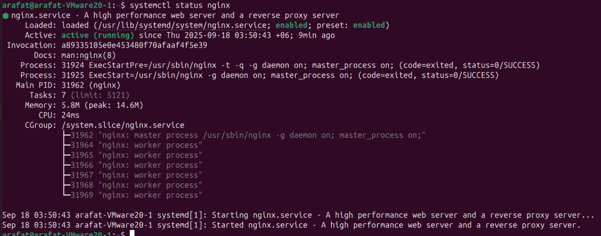

# systemd 

### Systemd is the process with PID 1, the very very first program to run

units in systemd are resources that it's able to manage. Example service, timer, mounts...

We will be focusing mainly on services, its a type of unit


## Then WHat is systemctl ?

Its the way we interact with systemd. Lets go to example


Lets install nginx

```bash
sudo apt install mginx

systemctl status nginx
```




### systemd commands

```bash
# restart a process, example: we updated our conf or certificate
systemctl restart nginx

# reload s service, configuration. Example nginx reloads
# All connections remains alive, but new config take in place
#not all service supports reload, it has to be defined on unit file
systemct reload nginx
#stop a service, SIGTERM
systemctl stop nginx

#force kill a service, SIGKILL
systemctl kill nginx

#creates a symlink, enables for boot
systemd enable docker

#disable upon boot
systemd disable docker


#reloading the systemctl
# run this after making any changes to unit files, this makes sure
# changes are counted into

systemctl daemon-reload
```

### but where these unit files lives ?

(based on priority)

- /etc/systemd/system

- /run/systemd/system

- /lib/systemd/system

Examle unit file 
```bash
[Unit]
Description=My Critical Service
Documentation=https://docs.example.com

# CRITICAL: Dependency ordering
After=network-online.target docker.service postgresql.service
Wants=network-online.target
Requires=docker.service  # Hard dependency - fails if docker fails

# For network-dependent services
After=network-online.target
Wants=network-online.target

# For mount-dependent services
After=data.mount
RequiresMountsFor=/data /var/log

[Service]
Type=simple
ExecStartPre=/usr/local/bin/pre-check.sh  # Pre-flight checks
ExecStart=/usr/bin/myservice
ExecStartPost=/usr/local/bin/notify.sh    # Post-start actions

# Restart policy - CRUCIAL for production
Restart=always              # always, on-failure, on-abnormal, on-success, no
RestartSec=10s             # Wait before restart
StartLimitInterval=300s    # Time window for counting failures
StartLimitBurst=5          # Max restarts in interval

# Timeouts
TimeoutStartSec=90s        # Time to wait for start
TimeoutStopSec=90s         # Time to wait for stop

# Health checks
ExecReload=/bin/kill -HUP $MAINPID
PIDFile=/var/run/myservice.pid

# Resource limits
LimitNOFILE=65536          # File descriptors
LimitNPROC=4096            # Processes
MemoryLimit=2G             # Memory cap

# Environment
Environment="LOG_LEVEL=info"
EnvironmentFile=/etc/myservice/env

# User/Group
User=myservice
Group=myservice

# Working directory
WorkingDirectory=/opt/myservice

[Install]
WantedBy=multi-user.target  # Standard multi-user runlevel
# WantedBy=network-online.target  # For network services
```


# logs and journalctl

### Default logs location
```bash
/var/logs 

/var/log/boot.log -> last boot log
/var/log/auth.log -> sshd log 
/var/log/syslog -> system events log

/var/log/dmesg -> kernel events log, most important
```

We can use *__tail -f logile.log__* to follow a logfile. Example

```bash
tail -f /var/log/syslog
tail /var/log/dmesg

#but there is a dmesg binary which tails dmesg logs with color, YAY

dmesg -H -q # -H -> human readable -w -> follow
```
 
## journalctl -> part of systemd 

Lets get all the logs from nginx

```bash
journalctl -xef -u nginx // -xefu will also work
# x -> extended verbose
#e -> go to end of log input
#f -> follow, eqv to tail
```

We want last 4 hours of logs

```bash
journalctl -xfu nginx --since "4 hour ago"
```

### cleaning up log files, on an emergency situation


