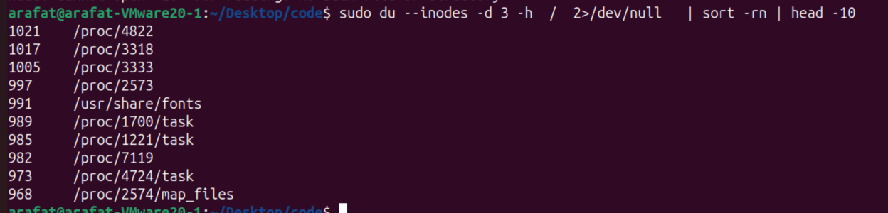
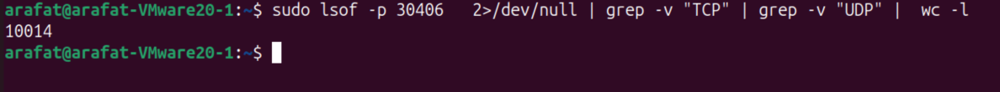

# DISK I/O deep dive

Red Flags in I/O Metrics

- await > 20ms (HDD) or > 10ms (SSD)
- %util consistently > 80%
- avgqu-sz > 1
- wa% in top > 10%
- Load average >> CPU cores with low CPU usage
- Processes in 'D' state
- si/so in vmstat > 0 (swapping)

## I/O 

Are we running out of disk space, who is eating all the space ? any log rotation cleanup stopped ? How we start 

We have too many small files, eating up all the inodes, even 50% space left we cannot write because of inode exhaustion


Lets check globally about space and inodes

```bash
df -h # disk free, human redable disk usage
#/dev/* -> device

df -i #disk usage, inode usages with percent

##too much inodes mean tons of small files, free disk space but unable to create files

````
## investigate inode culprits 
inode structure

```
Inode Structure:
├── File type (regular, directory, symlink, etc.)
├── Permissions (rwx)
├── Owner (UID) and Group (GID)
├── File size
├── Timestamps (atime, mtime, ctime)
├── Link count
├── Pointers to data blocks (where actual content is stored)
└── Extended attributes
```

#### FInd the inode culprit

```bash
sudo du --inodes -d 2 / 2>/dev/null | sort -rn | head -10
# / -> start from root instead of PWD, 2>/dev/null -> ignore error streams
```


Just increase depth and fine tune (start with d = 2/3 and go deep)


#### find the large file culprit
its pretty easy, just same as inodes command and just remove --inodes and add -h for more human friendly (YaY)

```bash
sudo du -h -d 2 / 2>/dev/null | sort -rh | head -10


#whenever you use -h (human redable), you must use sort -rh (-r -h) that means reverse order (-r) with human redable outputs (-h)
```

## Are any process doing too much file I/O or too many opened files ?


### Overall  process I/O stats using I/O top (sudo)

iostat -> first 6000 milisonds refer

We know one of our I/O block device is in pressure from iostat, but why ?

Here comes I/O top

```bash
sudo iotop -o #-a to accumulate metrics instead of Rate/S
```
Find the process with high IO and pidstat to dig deeper (duplicate from process section)

### get I/O operations based on PID
```bash
pidstat -d -p {PID} 1 #-d -> disk , 1 -> refresh intervalclear
# add -t for per thread stats
```


## *Process with too many open files FFS*

List All files excluding TCP /UDP connections

```bash
sudo lsof -p {PID} 2>dev/null | grep -v "TCP" | grep -v "UDP" | wc -l
#wc -> word_count, -l -> lines , exclude UDP/TCP connections
```

Test Application which manually opened 10000 files (+14 from OS)



