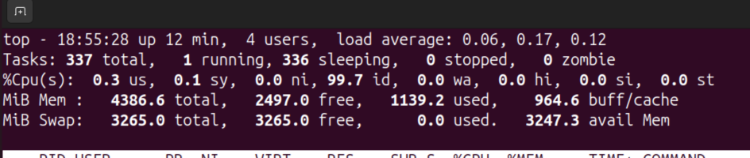
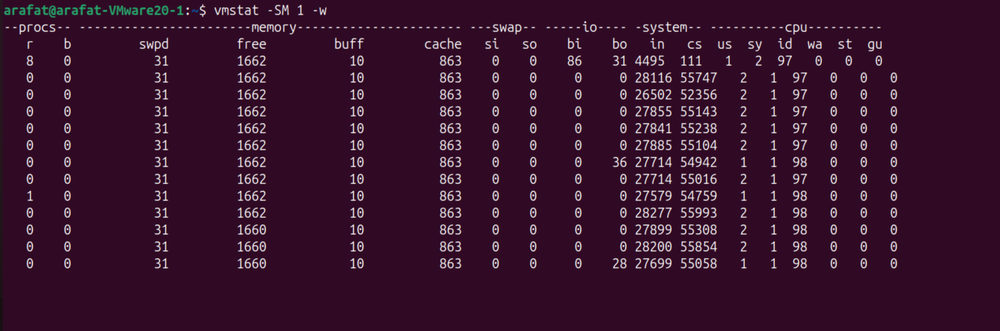

# The Baic Observability for first 60 seconds

Whenever we need to execute an investigation, we first run these. These are an overview to the whole system


## uptime

input

```bash
uptime
```
output

```bash
 ---------- load average: {1 minute} {5 minute} {15 minute}
```
CPU initial check, are we bottlenecking CPU recently


## top (avoid htop)

Real time Process view with CPU global view, MEM global view, and per process stats

Press "H" so switch to thread views



First Line: From uptime
Second: Running and sleep monitor. "H" to switch to threads.

**zombie-> parent aint handling childs, when parent dies, init takes them over**

us -> user space
sy -> system kerner space
ni -> low priority process
id -> idle time (sleep or waiting for external event)
wa -> wait, mostly IO, N.B: network wait is not I/O, its maily disk, keyboard ...
hi -> Hardware Interrupts,input from keyboard, network packet, ...
si -> software interrupt, eg: time.sleep(time.nanoseconds() * 5) in infinite loop;

MiB Mem: Physical Memory 
- total: actual physical memory available to system
- free: completely unused, imediaeatly available (doesn't include buffer, cache)
- used: Wired In memory, process + linux in total
- buff/cache: page metadata and page in cache (for faster access, no going disk)

## vmstat (use dstat if available)

```bash
vmstat -Sm 1  w #Sm: S->unit m-> Mib  1 -> refresh time w-> wide output
```


### procs
- r -> running process
- b blocked process: in uniterruptable sleep (I/O wait eg)
### memory
- swapd virtual memory swapped
- free idle memory
- buff -> raw blocks, metadata
- cache Memory used as page cache

### swap section
- si -> swap in rate from disk 
- so -> swap out rate from memory (memory pressure)

### I/O section

- bi -> block in, blocks received from disks, read activity
- bo -> block out, disk write activity

### *System || most Important*

- in -> interrupts (HW + SW), numbers of interrupts per second, 1K-50K normal (under heavy load)
- cs -> context switch, persec. Ideal 5K-20K per sec, even on high load.

Interrupt handled and returns to same process = no context switch
Interrupt wakes up higher priority process = context switch occurs

1-5 context switch per interrupt healthy ratio

### cpu section -> same as top


