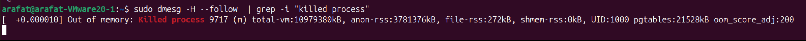
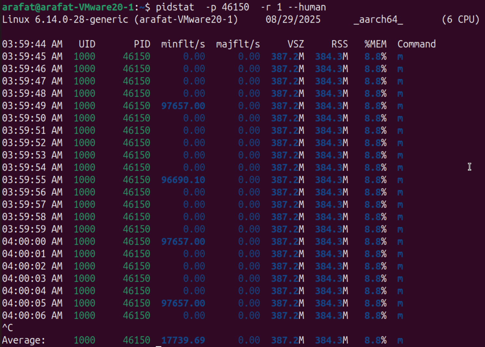

# Very First Steep, run free


```bash
free -h
```


### Kernel OOMKILL events


If the system is in memory pressure

```bash
sudo dmesg -H --follow | grep -i "killed process"
```
By this we can track when a process is killed (OOM killed)



### PID Stat memory analysis (Most important)

```bash
pidstat -p {PID} -r 1 --human
# -r -> memory 1 -> interval --human = more man friendly
```

x

VSZ -> virtual size
RSS -> Resident size

minFaults-> Cache missed, accessed memory
majFaults-> Not in memory, had to go to HDD, either HDD or SWAP, these are serious
