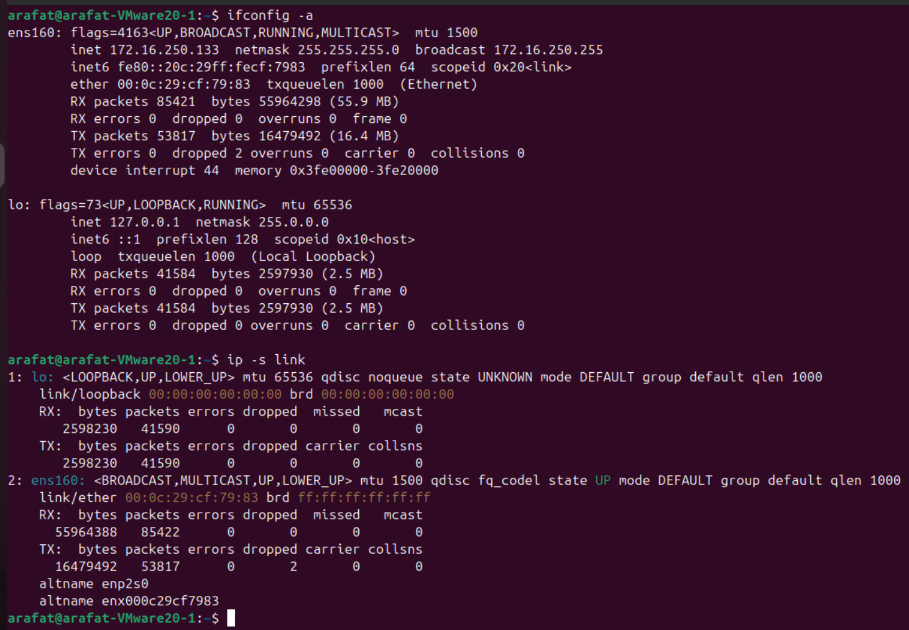
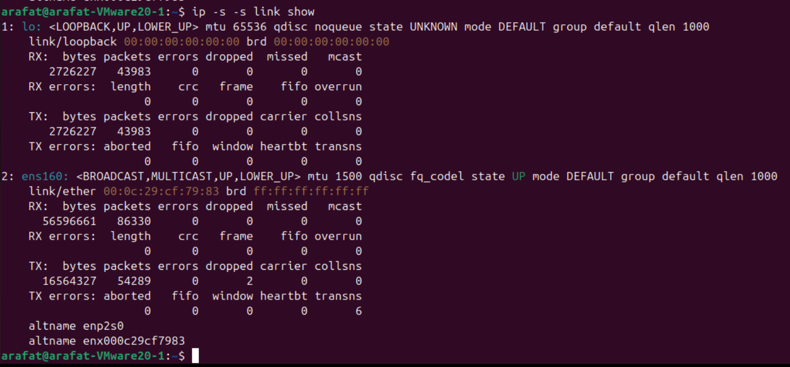

# Overall Inteface Stats

### Let's start checking from the interface

Interface -> 

```bash
ip -s link #more modern command

ifconfig -a #legacy, used by some dist still
```



Lets explain the ip -s link output, lets make it more verbose

```bash
#lest start with basic
ip link

#initial basic troubleshooting, to find if there is something wrong
ip -s link

#we had some errors, what kind of error they were, 
ip -s -s link show # -s -s detailed statistics, even for error
```



### RX Errors (Second Level):

- length: Packets with incorrect length
- crc: CRC (Cyclic Redundancy Check) failures - corrupted data
- frame: Frame alignment errors - malformed packets
- fifo: FIFO buffer overruns
- missed: Packets missed due to lack of resources

### TX Errors (Second Level):

- aborted: Transmission aborted errors
- fifo: FIFO buffer errors on transmit
- window: TCP window errors
- heartbeat: Heartbeat/keepalive failures
- transns: Transmission errors
