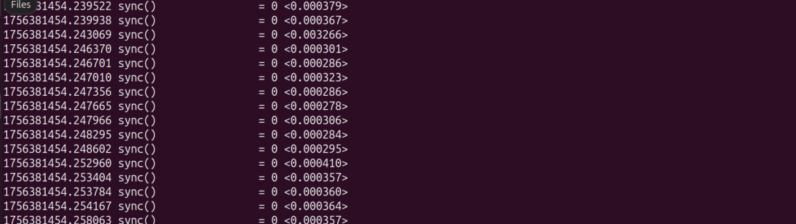
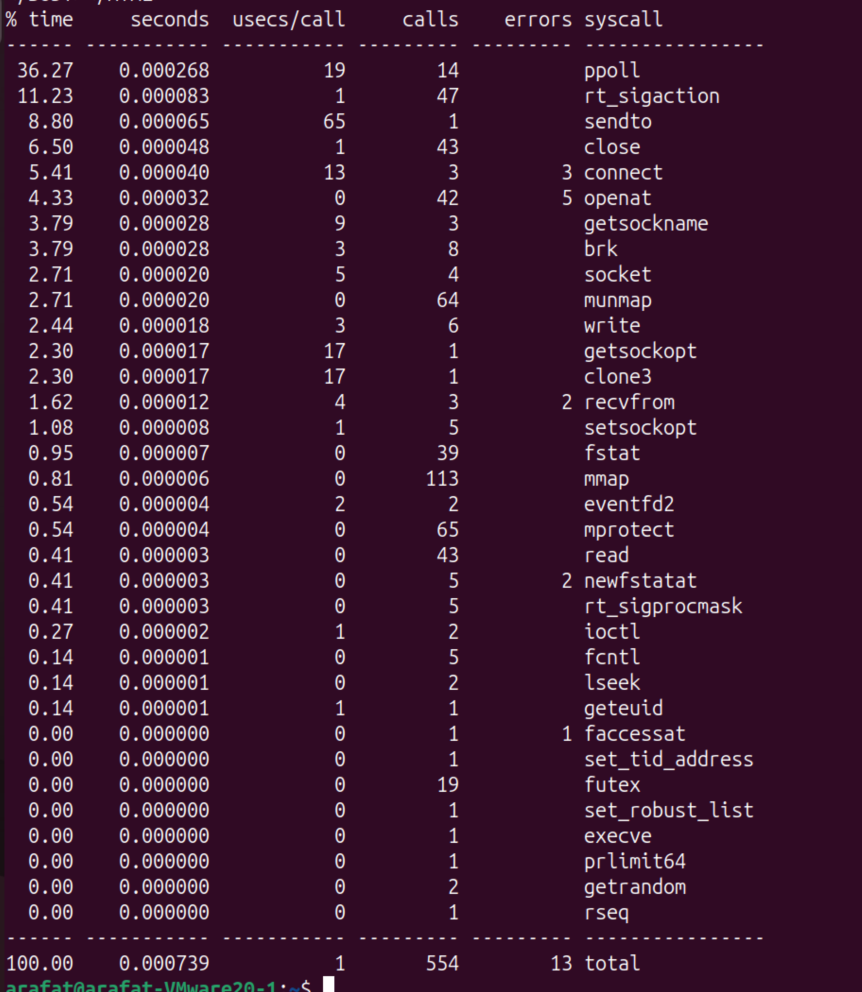
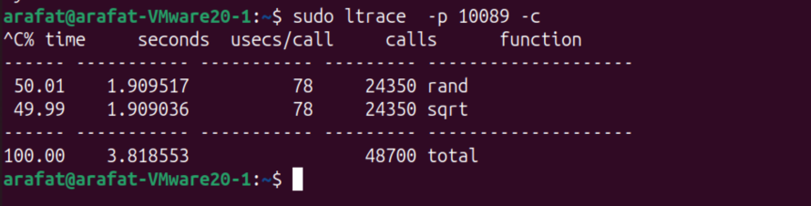
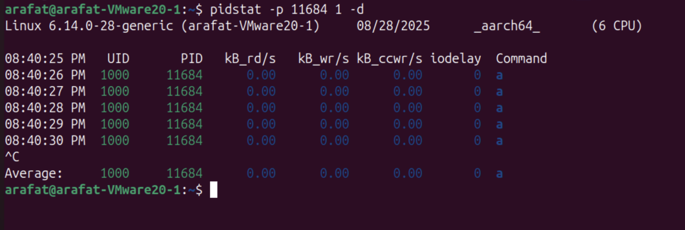
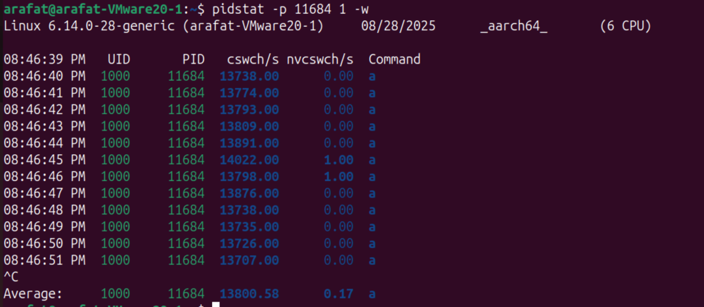

# strace (sudo required, slows the system)

trace a program's runtime behaviour, what kind of systemcall they are calling, what the hell they are doing


#### live tail strace

```bash
sudo strace -tttT -p {PID} # -ttt time since epoc, -T syscall time
```


sync() -> system call
= 0 -> return value
<0.000278> -> syscall exec duration, in  seconds
but the stream is super fast, sometimes we only want syscll stats (which one how many times)


```bash
sudo strace -c -p -f {PID}  #-c -> count calls, -f -> follow child(optional), -p {PID}
``` 



- %time -> total time spend during strace lifecycle

- usecs/call -> no of microseconds on avg in each call
- calls -> calls count
#you can also sort by time or calls

#### you can also sort the output based on time or calls

```bash
sudo strace -c -S time -p {PID} #by time %

sudo strace -c -S calls -p {PID} #by calls count
```

# ltrace (sudo required)

Sometimes the process is hogging through systemcalls, example some sqrt function, libc calls, stress -c 10 doesn't show anything in strace, in that case, we use ltrace

Note: strace can only trace dynamically linked libraries, not statically linked libraries during compile time

```bash
sudo ltrace -c -p {PID} 
```



same as strace, instead of syscalls we can see libcalls, dynamic shared library calls, this stress -c 1 has no syscall, syscall  is clear


# pidstat -> get I/O and CW info per process


### get I/O operations based on PID
```bash
pidstat -d -p {PID} 1 #-d -> disk , 1 -> refresh intervalclear
# add -t for per thread stats
```





### *__get CW info based on PID (important)__*

```bash
pidstat -p {PID} -w
```



cswch/s -> voluntary context switches, Sleep(), IO_wait(), read()...

nvcswch/s -> non-voluntary, time slice expired, high priority takeover, resource limits. This indicates CPU being overloaded, remember preemtive scheduling ?