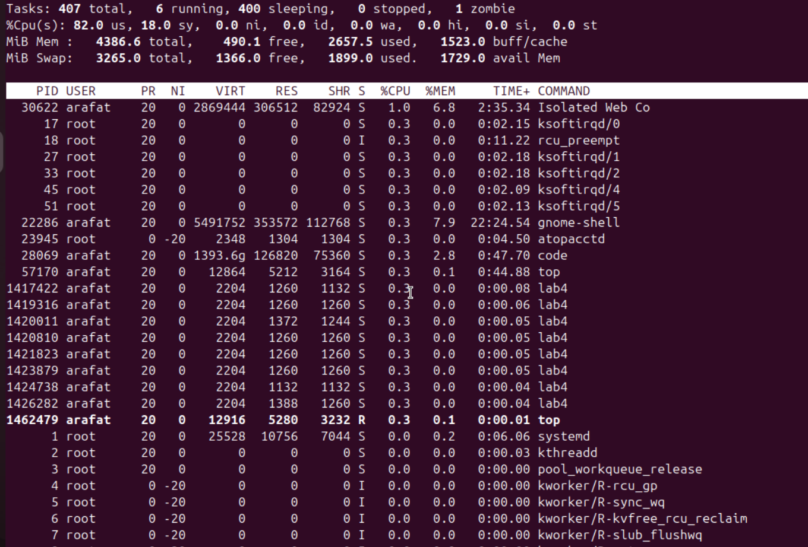
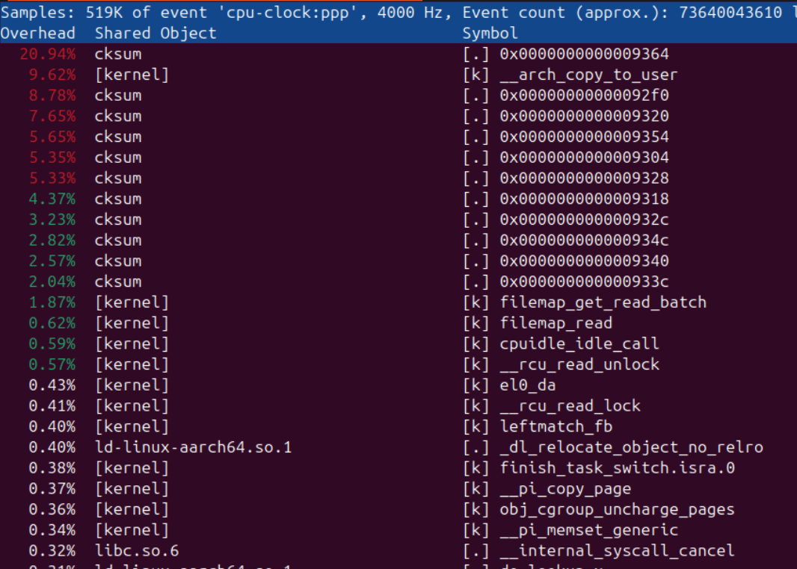
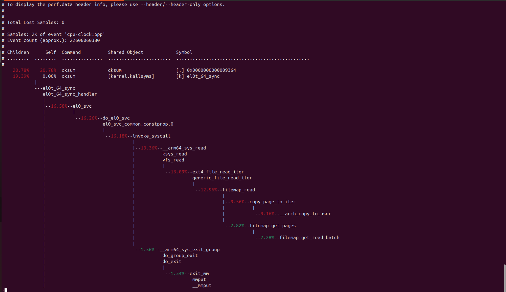

# Advanced - 01

## A short lived process is a resource intensive task, which hogs but lives for very small amount of time, thus they are hard to find out

Example Code
```c++
/*
Original Source: https://github.com/brendangregg/perf-labs/blob/master/src/lab004.c
*/

#include <sys/types.h>
#include <sys/stat.h>
#include <fcntl.h>
#include <stdio.h>
#include <stdlib.h>
#include <unistd.h>

const char *datafile = "lab004.data";

#define BUFSIZE		(8 * 1024)
#define FILESIZE	(10 * 1024 * 1024)

void
init_data()
{
	int fd;
	long long i;
	char buf[BUFSIZE];

	if ((fd = open(datafile, O_CREAT | O_WRONLY, 0644)) < 0) {
		printf("ERROR: Can't open datafile: %s\n", datafile);
		exit(1);
	}

	for (i = 0; i < FILESIZE / BUFSIZE; i++) {
		if (write(fd, buf, BUFSIZE) < 0) {
			printf("ERROR: write error.\n");
			exit(2);
		}
	}

	close(fd);
}

void
check_log()
{
	char cmd[256];
	snprintf(cmd, sizeof (cmd), "cksum %s >/dev/null 2>&1", datafile);

	system(cmd);
}

int
main()
{
	init_data();

	for (;;) {
		check_log();
	}

	return (0);
}
```

In this scenario, if we do top we can see zero idle, but no process is taking significant resource

## top output


### *__we have 0% idle, means cpu hogged to the edge, but look, top's output is so lame, like nothing happened. barely touching cpu__*

In these scenarios, it means we are having a ton of short lived processes, we need to sample to figure this out

Use Perf tools to figure out & also strace with follow mode

Lets run perf top
```bash
sudo perf top

##Or we can dump data

sudo perf recoed -F 99 -a -g -- sleep 10

sudo perf report --stdio
```



Ahh, someone is calling checksum (cksum)


Lets see our output of perf report



Much cleaner 